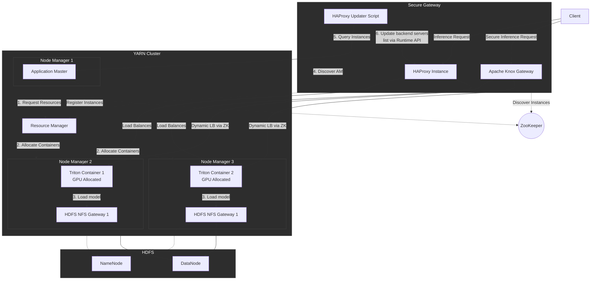

TARN is a scalable inference solution for running NVIDIA Triton Inference Server on a Hadoop/YARN cluster using Docker containers.

## Architecture

## What you'll find here

- Prerequisites and cluster sizing
- Building and deploying the orchestrator
- Model repository configuration (HDFS/NFS)
- Load balancing and service discovery
- Security with Apache Ranger
- Operations, monitoring, and scaling
- Examples using Open Inference Protocol

Goal: Run production Triton Inference Server on YARN with GPU support, auto-scaling, and ecosystem integration.