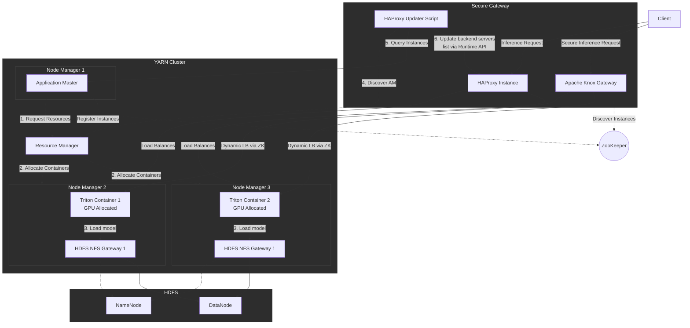

TARN is a scalable inference solution for running NVIDIA Triton Inference Server on a Hadoop/YARN cluster using Docker containers.

## Architecture

```mermaid
graph TB
    %% Client
    Client[Client]

    %% Perimeter Security & LB
    subgraph Perimeter ["Secure Gateway"]
        HA[HAProxy Instance]
        Knox[Apache Knox Gateway]
        Updater[HAProxy Updater Script]
    end

    %% ZooKeeper
    ZK((ZooKeeper))

    %% YARN Cluster
    subgraph YARN ["YARN Cluster"]
        RM[Resource Manager]

        subgraph NM1 ["Node Manager 1"]
            AM[Application Master]
        end

        subgraph NM2 ["Node Manager 2"]
            TC1[Triton Container 1
GPU Allocated]
            NFS1[HDFS NFS Gateway 1]
        end

        subgraph NM3 ["Node Manager 3"]
            TC2[Triton Container 2
GPU Allocated]
            NFS2[HDFS NFS Gateway 1]
        end

        TC1 -->|3. Load model| NFS1
        TC2 -->|3. Load model| NFS2
    end

    %% HDFS
    subgraph HDFS ["HDFS"]
        NN[NameNode]
        DN[DataNode]
    end

    %% Connexions principales (flux vertical)
    Client -->|Inference Request| HA
    Client -->|Secure Inference Request| Knox
    HA -->|Load Balances| TC1
    HA -->|Load Balances| TC2
    Knox -->|Dynamic LB via ZK| TC1
    Knox -->|Dynamic LB via ZK| TC2

    %% Interactions YARN
    AM -.->|1. Request Resources| RM
    RM -.->|2. Allocate Containers| NM2
    RM -.->|2. Allocate Containers| NM3

    %% ZooKeeper Registration
    AM -.->|Register Instances| ZK
    Knox -.->|Discover Instances| ZK

    %% Découverte et mise à jour HAProxy
    Updater -.->|4. Discover AM| RM
    Updater -->|5. Query Instances| AM
    Updater -->|6. Update backend servers
list via Runtime API| HA

    %% Accès HDFS via NFS Gateway
    NFS1 -.-> NN
    NFS2 -.-> NN
    NFS1 --> DN
    NFS2 --> DN

    %% Style pour forcer l'empilement vertical
    classDef cluster fill:#2d2d2d,stroke:#444,color:#fff;
    class Perimeter,YARN,HDFS cluster;
```

## What you'll find here

- Prerequisites and cluster sizing
- Building and deploying the orchestrator
- Model repository configuration (HDFS/NFS)
- Load balancing and service discovery
- Security with Apache Ranger, TLS, and token-based authn
- Operations, monitoring, and scaling
- Examples using Open Inference Protocol and OpenAI-compatible SDKs
- Kubernetes Operator (alternative to YARN submission)

Goal: Run production Triton Inference Server on YARN **or Kubernetes** with GPU support, auto-scaling, and deep ecosystem integration (Ranger, Knox, Prometheus, OpenTelemetry, Gateway API).

## What's new

LLM serving, security hardening, and multi-tenancy features have been added. Existing YARN deployments continue to work unchanged — new capabilities are opt-in via CLI flags.

**LLM serving**
- **OpenAI-compatible proxy** on a dedicated port (`--openai-proxy-enabled`). Exposes `/v1/chat/completions`, `/v1/completions`, `/v1/embeddings`, `/v1/models` with SSE streaming relayed byte-for-byte.
- **Multi-LoRA routing**: drop a `lora.json` at the root of your model repository; clients address adapters as `"base_model#adapter"`. Ranger policies can target combined names.
- **Token chargeback** per (user, model): counters `tarn_tokens_in_total` / `tarn_tokens_out_total` in `/metrics`. Non-streaming usage is auto-extracted from OpenAI responses; streaming clients POST to `/v1/usage`.
- **Queue-aware scaling** (`--scale-mode=composite`, default): combines GPU utilization with per-container queue depth so LLM workloads (GPU pinned at 100% by design) scale correctly.
- **Model warmup**: containers aren't registered in ZooKeeper until `/v2/health/ready` passes, so Knox never routes to a cold backend.

**Security**
- **TLS** for the AM HTTP server (`--tls-enabled --tls-keystore hdfs:///tarn/certs/keystore.jks`), keystore password resolved via Hadoop credential provider.
- **Constant-time token compare** (`MessageDigest.isEqual`), query-string tokens refused.
- **Shell injection** closed in `--model-repository` / `--secrets` paths.
- **SSRF guard** on the metrics scraper (loopback / link-local / metadata endpoints refused).
- **Ranger fail-closed** (`--ranger-strict`, default-on when Ranger configured) + full client-IP propagation to audit.
- **Inference-level enforcement** on the OpenAI proxy (`infer` permission on base AND `base#lora` combined resource).
- **Security response headers** on every endpoint: HSTS (on TLS), nosniff, DENY frames, no-referrer, no-store.

**Multi-tenancy & operations**
- **Quotas & rate limiting** per (user, model) with JSON rules (`--quotas hdfs:///tarn/quotas.json`). 429 with `Retry-After`.
- **Hot-reload via ZooKeeper** of quota rules; also available via **`/admin/quotas` REST API** (GET / POST).
- **Graceful drain** on scale-down: deregister from ZK, wait for queue to drain (`--drain-timeout-ms`), then SIGTERM.
- **Non-NVIDIA accelerators**: `--accelerator-type {nvidia_gpu|amd_gpu|intel_gaudi|aws_neuron|cpu_only}`.
- **GPU sharing via MIG** (`--gpu-slice-size 1g.10gb`).
- **Shadow traffic** for A/B comparison (`--shadow-endpoint … --shadow-sample-rate 0.01`).

**Observability**
- **Native Prometheus histograms** (`tarn_inference_latency_seconds`), aggregatable across replicas.
- **Request counters** split by outcome: `tarn_inference_requests_total{model,status="success|error"}`.
- **OpenTelemetry tracing** (API-only, agent-activated): SERVER span per proxy request, CLIENT span for upstream Triton, W3C `traceparent` propagation, MDC push of `trace_id` / `span_id`.
- **Structured JSON logs** via `TarnJsonLayout` (activate with `-Dlog4j.configuration=log4j-json.properties`).
- **Enriched dashboard** with top-N token consumers, active quota rules, LoRA adapters.

**Kubernetes-native alternative to YARN**
- **TARN Operator** watches `TritonDeployment` CRs (`tarn.varga.io/v1alpha1`) and reconciles them into native Deployments + Services. Supports leader election for HA.
- **Weighted traffic split** (canary / blue-green / A-B) via `spec.traffic[]`; optional Gateway API HTTPRoute generation for precise routing.
- Same image, different entrypoint — or deploy both paradigms side-by-side.

See the dedicated pages: [Configuration](./configuration.md), [Security](./security.md), [Operations](./operations.md), [Kubernetes Operator](./kubernetes-operator.md), [Examples](./examples.md).